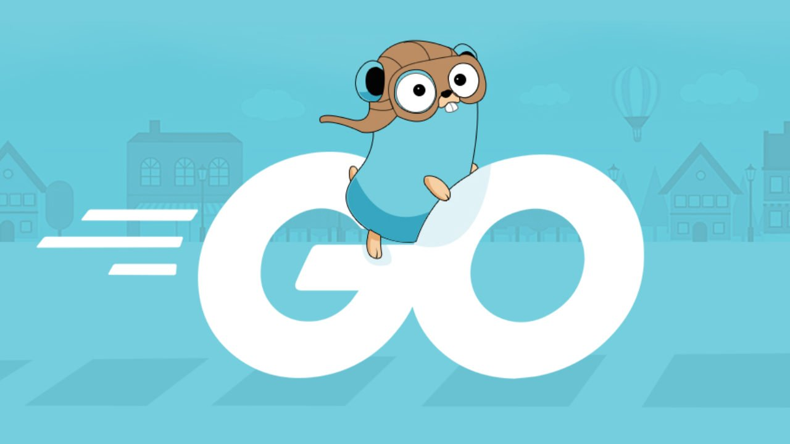
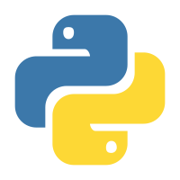
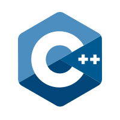
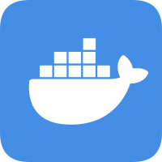
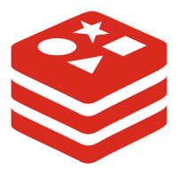

    

  &emsp;
  &emsp;
  &emsp;
  &emsp;
  &emsp;
  &emsp;

我是蔚蓝🦊
---

Hello，我是一位程序员 + 学生 + 博主 + 科技爱好者:
- 😭一名计算机专业的大四学生，熬夜苦肝论文中o(╥﹏╥)o
- 🐳热衷于分享与记录的博主，欢迎访问我的[个人网站www.weilanx.com](https://www.weilanx.com/)
- 💫励志成为一名大up主\(^o^)/~ 欢迎访问我的B站：[叫我蔚蓝就好](https://space.bilibili.com/473970050)

  

## 个人技术栈
出来混江湖，技多不压身:
- 🥸一位优秀的后端 `Ctrl+C/V` 程序员，炉火纯青的 `CRUD` 技艺
- 🎀一位被 `Java` 耽误的前端工程师, 后端哪有画页面好玩
- 🎋听说你也是全栈程序员? 不好意思, 鄙人还会点算法🤡
- 💻业余黑客，千里之外取服务器首级如探囊取物😎
- 🪼Vibe Coding忠实粉丝，AI必将改变人类🌋
- 🥘被编程耽搁的天才厨子, 毕竟编程哪有做饭香🍜

<table>
  <tr align="center">
    <td align="center" width="96">
      
       Java
    </td>
    <td align="center" width="96">
      
       Python
    </td>
    <td align="center" width="96">
      
       TypeScript
    </td>
    <td align="center" width="96">
      
       C++
    </td>
    <td align="center" width="96">
      
       Docker
    </td>
    <td align="center" width="96"> 
      
       Linux
    </td>
    <td align="center"  width="96">
      
       Redis
    </td>
    <td align="center" width="96">
      
       React
    </td>
  </tr>
</table>

---

    
    
    
    
    
    
    
    
    
    
    
    
    
    
    
    
    
    
    
    
    
    
    
    
    
    
    
    
    
    
    
    
  

## 开源小游戏🎮
希望游戏能给你沉闷的生活带来一点乐趣:
- ✡️使用纯html编写的 [2048小游戏(点我直接开玩)](https://azure12355.github.io/game-2048/) | [开源地址](https://github.com/Azure12355/game-2048)
- ♨️超经典的童年小游戏, 包你百玩不厌的 [坦克大战(一起happy吧!!!)](https://azure12355.github.io/game-tank-battle/) | [开源地址](https://github.com/Azure12355/game-tank-battle) 
- 💀基于 `html` + `css` + `javascript` 编写的纯静态 [植物大战僵尸（魔改版）一起摇滚吧。。](https://azure12355.github.io/game-plant-vs-zombies/) | [开源地址](https://github.com/Azure12355/game-plant-vs-zombies)
- 🏗️一款十分考验反应力和判断力的游戏 [塔楼建造](https://azure12355.github.io/tower_game/) | [开源地址](https://azure12355.github.io/tower_game/)，你能搭几层楼呢？

    

  
  

  

<!---
Azure12355/Azure12355 is a ✨ special ✨ repository because its `README.md` (this file) appears on your GitHub profile.
You can click the Preview link to take a look at your changes.
--->
