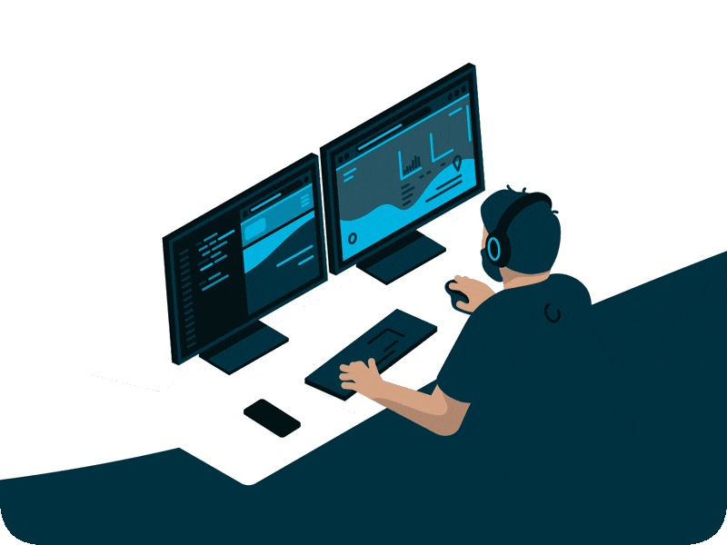
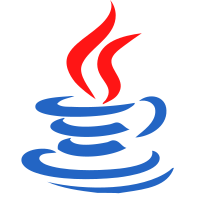
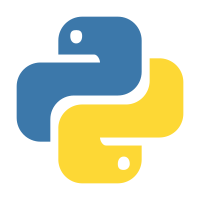
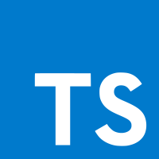
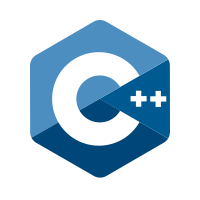
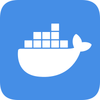
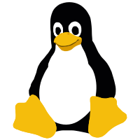
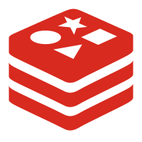
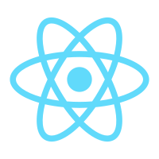

  

<h1 align="center">你好，我是蔚蓝 🦊</h1>

  <strong>AI 产品经理 · 独立开发者 · 内容创作者</strong>

  把想法做成产品，也把过程写给后来的人。

<em>✦ Lead AI · Build everything</em>

  
  
  
  
  

  

## 个人技术栈

出来混江湖，技多不压身:

- 🥸一位优秀的后端 `Ctrl+C/V` 程序员，炉火纯青的 `CRUD` 技艺
- 🎀一位被 `Java` 耽误的前端工程师, 后端哪有画页面好玩
- 🎋听说你也是全栈程序员? 不好意思, 鄙人还会点算法🤡
- 💻业余黑客，千里之外取服务器首级如探囊取物😎
- 🪼Vibe Coding忠实粉丝，AI必将改变人类🌋
- 🥘被编程耽搁的天才厨子, 毕竟编程哪有做饭香🍜

<table>
  <tr align="center">
    <td align="center" width="96">
      
       Java
    </td>
    <td align="center" width="96">
      
       Python
    </td>
    <td align="center" width="96">
      
       TypeScript
    </td>
    <td align="center" width="96">
      
       C++
    </td>
    <td align="center" width="96">
      
       Docker
    </td>
    <td align="center" width="96">
      
       Linux
    </td>
    <td align="center" width="96">
      
       Redis
    </td>
    <td align="center" width="96">
      
       React
    </td>
  </tr>
</table>

---

  
  
  
  
  
  
  
  
  
  
  
  
  
  
  
  
  
  
  
  
  
  
  
  
  
  
  
  
  
  
  
  

## 开源小游戏🎮

希望游戏能给你沉闷的生活带来一点乐趣:

- ✡️使用纯html编写的 [2048小游戏(点我直接开玩)](https://azure12355.github.io/game-2048/) | [开源地址](https://github.com/Azure12355/game-2048)
- ♨️超经典的童年小游戏, 包你百玩不厌的 [坦克大战(一起happy吧!!!)](https://azure12355.github.io/game-tank-battle/) | [开源地址](https://github.com/Azure12355/game-tank-battle)
- 💀基于 `html` + `css` + `javascript` 编写的纯静态 [植物大战僵尸（魔改版）一起摇滚吧。。](https://azure12355.github.io/game-plant-vs-zombies/) | [开源地址](https://github.com/Azure12355/game-plant-vs-zombies)
- 🏗️一款十分考验反应力和判断力的游戏 [塔楼建造](https://azure12355.github.io/tower_game/) | [开源地址](https://azure12355.github.io/tower_game/)，你能搭几层楼呢？

  

  
  

  

## 在哪里找到我

- [个人主页](https://www.weilanx.com/)：我的身份与作品入口
- [蔚蓝空间栈](https://spacex.weilanx.com/)：持续更新的 AI Coding 学习网站
- [个人博客](https://blog.weilanx.com/)：Build Log、复盘与更个人的思考
- [作品集](https://pages.weilanx.com/)：项目与设计作品
- [Bilibili](https://space.bilibili.com/473970050) / [X](https://x.com/zureA255062)：视频、近况与碎片思考

  <strong>心怀想象，持续构建，温柔向前。</strong> 
  <em>✦ Lead AI · Build everything</em>

